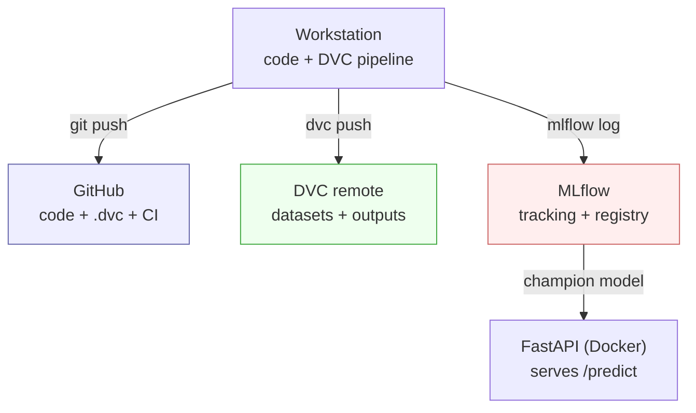
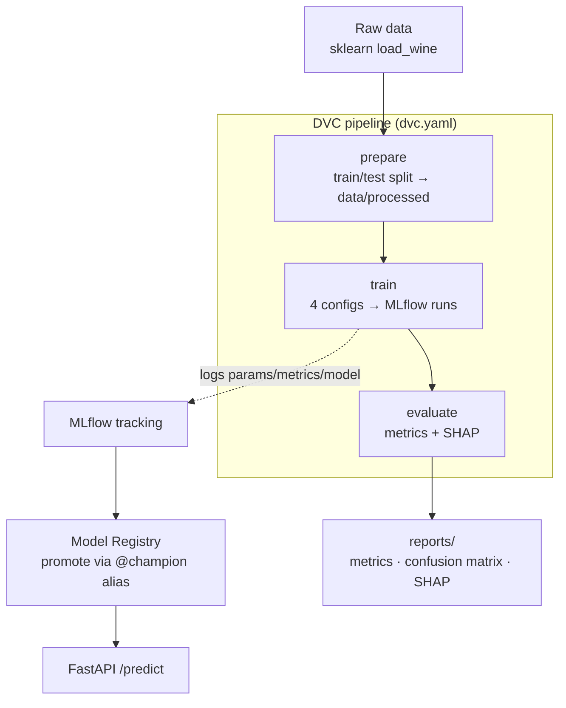

# MLOps Pipeline for Wine Classification

[](https://github.com/anycodef/mlops-wine-classifier/actions/workflows/ci.yml)

An end-to-end MLOps project that takes a classification model through the full
lifecycle — **prepare → train → evaluate → register → serve → monitor** — using
a stack where each tool owns a single responsibility and hands off cleanly to
the next.

The modelling task itself is deliberately small (scikit-learn's Wine dataset, a
3-class problem) so the focus stays on the *operational* machinery: experiment
tracking, model versioning, reproducible pipelines, explainability, serving and
drift monitoring.

---

## Why several tools?

In a machine-learning project there are three different things to version, and
Git alone does not cover them:

| Concern | Tool | What it stores |
| --- | --- | --- |
| Source code | **Git / GitHub** | scripts, config, CI/CD |
| Data & heavy artifacts | **DVC** | datasets and pipeline outputs (only lightweight `.dvc` pointers live in Git) |
| Experiments & models | **MLflow** | params, metrics, packaged models, the Model Registry |
| Explainability | **SHAP** | per-feature contributions to predictions |
| Serving | **FastAPI + Docker** | a REST `/predict` endpoint backed by the registry |

None of them overlaps: they communicate through clean hand-offs — a `.dvc`
metafile, a registered model version, a tracking URI.

---

## Architecture



## Pipeline

The three core stages are defined in `dvc.yaml`. A single `dvc repro` re-runs
only what changed, in dependency order.



---

## Repository structure

```
.
├── dvc.yaml                 # pipeline definition (prepare → train → evaluate)
├── params.yaml              # single source of truth for parameters
├── src/
│   ├── config.py            # paths, MLflow names, param loading
│   ├── prepare.py           # load_wine → reproducible train/test split
│   ├── train.py             # trains 4 configs, logs runs, picks the best
│   ├── evaluate.py          # metrics, confusion matrix, SHAP summary
│   ├── register_model.py    # registers + promotes the best run (@champion)
│   ├── predict.py           # batch demo consuming the promoted model
│   └── monitor.py           # accuracy-decay / drift simulation
├── api/                     # FastAPI serving app (loads @champion)
├── tests/                   # unit tests (schemas, training configs, API)
├── Dockerfile               # serving / server image
├── docker-compose.yml       # MLflow server + API
├── .github/workflows/ci.yml # reproduce pipeline + run tests
└── docs/architecture.md     # deeper design notes
```

---

## Quickstart (local)

> Common tasks are wrapped in a `Makefile` — run `make help` to list them
> (`make setup`, `make repro`, `make ui`, `make register`, `make serve`, ...).

```bash
python -m venv .venv && source .venv/bin/activate
pip install -r requirements.txt

# 1. Run the reproducible pipeline (prepare → train → evaluate)
dvc repro

# 2. Inspect and compare runs in the MLflow UI
mlflow ui --backend-store-uri sqlite:///mlflow.db      # http://localhost:5000

# 3. Promote the best run to the registry under the @champion alias
python -m src.register_model

# 4. Consume the promoted model
python -m src.predict

# 5. Simulate post-deployment drift
python -m src.monitor
```

All tracking data lives locally: `mlflow.db` (backend store) and `mlruns/`
(artifact store). The tracking URI is configurable via `MLFLOW_TRACKING_URI`.

---

## Experiment tracking & the Model Registry

`train.py` trains four configurations and logs each as an independent MLflow run
with its parameters, metrics and packaged model:

| Run | Model | Params | Accuracy | F1 macro |
| --- | --- | --- | --- | --- |
| `rf_10`   | RandomForest       | n_estimators=10  | 1.000 | 1.000 |
| `rf_100`  | RandomForest       | n_estimators=100 | 1.000 | 1.000 |
| `logreg`  | LogisticRegression | max_iter=1000    | 0.972 | 0.971 |
| `svm_rbf` | SVM                | kernel=rbf, C=1  | 0.972 | 0.971 |

The best run (by `train.selection_metric` in `params.yaml`) is registered as
`wine_classifier` and promoted with the **`champion`** alias.

> **On stages vs. aliases:** MLflow model *stages* (Staging/Production) are
> deprecated since MLflow 2.9. This project uses the current mechanism — a
> registered version plus an alias. Serving loads
> `models:/wine_classifier@champion`, so promotion and rollback are a one-line
> alias move with no code change or redeploy.

---

## Serving

FastAPI loads the champion model once at startup and exposes it:

```bash
uvicorn api.main:app --reload        # http://localhost:8000/docs
```

```bash
curl -X POST http://localhost:8000/predict \
  -H "Content-Type: application/json" \
  -d '{"samples":[{"alcohol":14.23,"malic_acid":1.71,"ash":2.43,
       "alcalinity_of_ash":15.6,"magnesium":127,"total_phenols":2.8,
       "flavanoids":3.06,"nonflavanoid_phenols":0.28,"proanthocyanins":2.29,
       "color_intensity":5.64,"hue":1.04,
       "od280_od315_of_diluted_wines":3.92,"proline":1065}]}'
```

### Containerized (MLflow server + API)

```bash
docker compose up -d mlflow
MLFLOW_TRACKING_URI=http://localhost:5000 dvc repro
MLFLOW_TRACKING_URI=http://localhost:5000 python -m src.register_model
docker compose up -d api
```

The MLflow server runs with `--serve-artifacts`, so the API fetches the model
over HTTP and never depends on local file paths.

---

## Monitoring

`monitor.py` simulates daily accuracy after deployment and compares it against a
business retraining threshold (`monitor.retrain_threshold`, default `0.85`),
reporting the first day the model would fall below it. In production this series
would be computed from live traffic; here it is seeded for reproducibility. The
proposed response to breaching the threshold is to re-run the pipeline on fresh
data and repeat the register/promote flow.

---

## Continuous integration

`.github/workflows/ci.yml` installs the environment, runs `dvc repro` end to end
and executes the test suite on every push and pull request, guaranteeing the
pipeline stays reproducible and the code stays green.

See [`docs/architecture.md`](docs/architecture.md) for deeper design notes.
